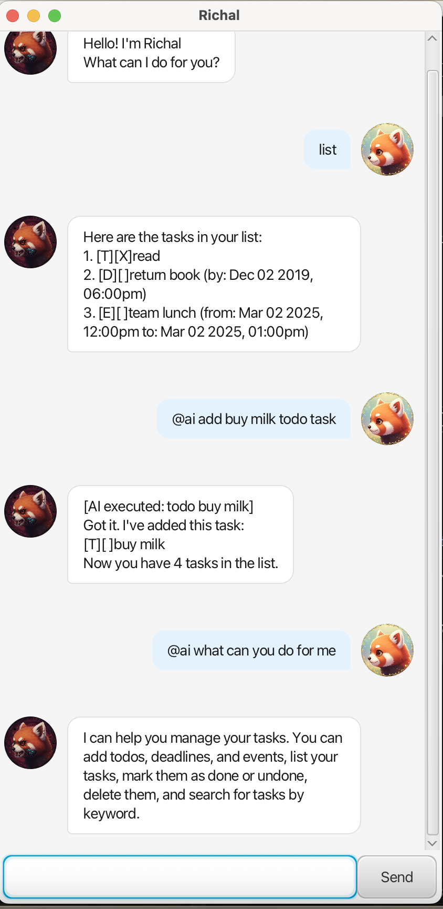

# Richal User Guide

Richal is a simple task management chatbot with a JavaFX GUI. You can add tasks, list them, mark them as done, search by keyword, and ask an AI assistant about features or even let it execute commands.

## Screenshot



## Quick start

- **Run**: `./gradlew run`
- **Type commands** in the input box and press Enter (or click **Send**).

## Command summary

- **Add todo**: `todo <description>`
- **Add deadline**: `deadline <description> /by <dateTime>`
- **Add event**: `event <description> /from <dateTime> /to <dateTime>`
- **List tasks**: `list`
- **Mark done**: `mark <taskNumber>`
- **Mark not done**: `unmark <taskNumber>`
- **Delete**: `delete <taskNumber>`
- **Find**: `find <keyword>`
- **AI assistant**: `@ai <message>` (can answer questions or execute actions)
- **Exit**: `bye`

Notes:
- `<taskNumber>` is **1-based** (e.g. `mark 1` marks the first task).
- Richal prevents adding **duplicate** tasks (same type + same description + same date/time fields, if any).

## Features

### Add a todo

Format:
- `todo <description>`

Example:
- `todo read book`

### Add a deadline

Format:
- `deadline <description> /by <dateTime>`

Example:
- `deadline return book /by 2/12/2019 1800`

### Add an event

Format:
- `event <description> /from <dateTime> /to <dateTime>`

Example:
- `event team lunch /from 2/3/2025 1200 /to 2/3/2025 1300`

### List tasks

Format:
- `list`

### Mark / unmark a task

Format:
- `mark <taskNumber>`
- `unmark <taskNumber>`

Examples:
- `mark 2`
- `unmark 2`

### Delete a task

Format:
- `delete <taskNumber>`

Example:
- `delete 3`

### Find tasks by keyword

Format:
- `find <keyword>`

Example:
- `find book`

### AI assistant

Format:
- `@ai <message>`

Examples:
- `@ai how do I add a deadline?`
- `@ai add a task to buy milk`
- `@ai show my tasks`

If you type just `@ai`, Richal will treat it as a greeting.

Behavior:
- If your message is a **question**, Richal will reply in natural language.
- If your message is an **action request**, Richal may translate it into a valid command and execute it.
  In that case, the reply will start with `[AI executed: ...]`.

## Troubleshooting

### I clicked “Run Java” in the IDE and it failed

This project uses **Gradle** to provide the correct runtime classpath (JavaFX + AI dependencies).
Use:

- `./gradlew run`

### AI assistant says it is unavailable

The AI feature requires an environment variable named `LLM_API_KEY`.

- macOS (zsh):

```bash
export LLM_API_KEY="YOUR_API_KEY"
./gradlew run
```

## Date/time formats

Richal accepts multiple input formats for `<dateTime>`:

- `d/M/yyyy HHmm` (e.g. `2/12/2019 1800`)
- `d/M/yyyy HH:mm` (e.g. `2/12/2019 18:00`)
- `yyyy-MM-dd HHmm` (e.g. `2019-12-02 1800`)
- `yyyy-MM-dd HH:mm` (e.g. `2019-12-02 18:00`)
- Date only (defaults to `00:00`), e.g. `2/12/2019` or `2019-12-02`